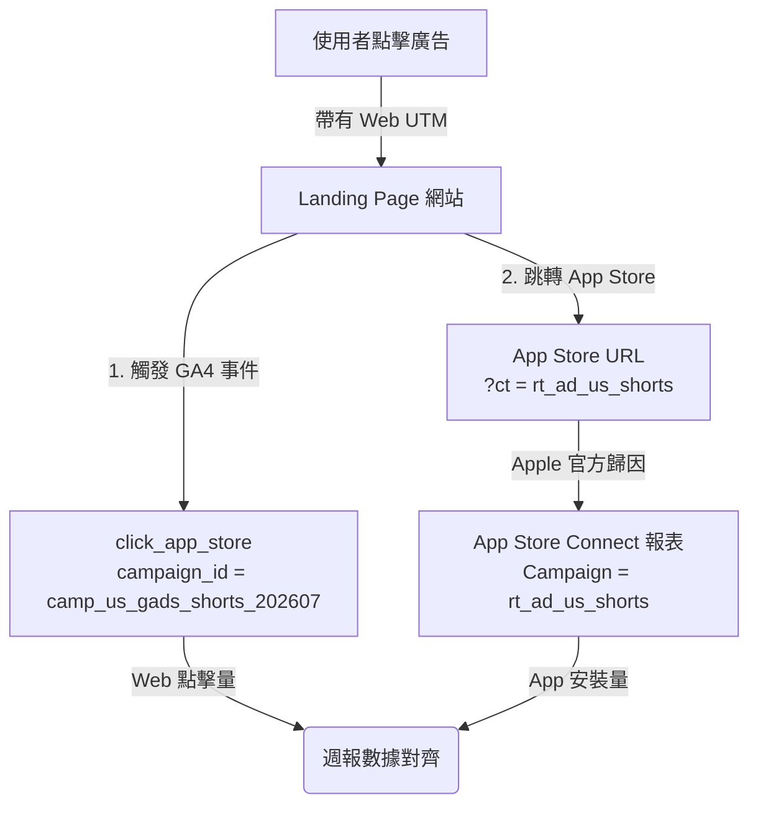

# VerifyAI Campaign 命名與 UTM 規範 (Campaign Taxonomy)

- **版本**：1.0
- **更新日期**：2026-07-16
- **適用專案**：VerifyAI Landing Page
- **文件角色**：定義跨行銷管道、網站事件與 App 商店歸因的 UTM 與 Campaign 統一命名規範

---

## 1. 目的與設計原則

為了解決多渠道推廣時，數據因拼寫不一致、歸因口徑不同而導致數據割裂的問題，本文件制定了 **VerifyAI** 的 **Campaign 與 UTM 命名規範**。

本規範遵循以下設計原則：
1. **跨平台唯一識別 (Single Source of Truth ID)**：同一個廣告活動 (Campaign) 在 Google Ads 廣告後台、GA4 網頁事件、App Store Connect (ASC) 數據後台以及團隊內部週報中，必須使用同一個 Campaign ID 作為關聯鍵。
2. **零容忍拼寫偏差 (Strict Enums Only)**：嚴格限制流量來源 (`utm_source`) 與媒介 (`utm_medium`) 的允許值，杜絕 `googleads`、`google_ads`、`Google Ads` 等多種寫法混用，確保數據庫過濾時的乾淨度。
3. **技術透明與解耦 (Technical Attribution Realism)**：明確區分「網頁端 UTM」與「App 安裝歸因」的技術邊界，不把網頁 UTM 與 App 安裝劃上等號，並提供官方/非官方的安裝數據對齊機制。

---

## 2. 關鍵警告：Web UTM 與 App Store 安裝歸因的技術邊界

> [!WARNING]
> **一般網頁 UTM 參數無法自動傳遞給 App Store，亦不等同於 App 安裝歸因。**
> 
> 當使用者在瀏覽器中點擊包含 `?utm_source=google_ads&utm_campaign=xyz` 的網頁連結，隨後在 Landing Page 上點擊 CTA 跳轉到 Apple App Store 時：
> 1. **Web UTM 丟失**：Apple App Store 的伺服器會**完全忽略** URL 中的 `utm_source`、`utm_medium`、`utm_campaign` 等 Web 參數，更無法在 App 被下載安裝後將這些網頁參數傳遞給 App 內部的任何 SDK。
> 2. **安裝歸因不等於點擊追蹤**：
>    - **網頁端點擊追蹤 (`click_app_store`)**：僅能追蹤使用者在網頁上的「離站下載意願 (Outbound Click)」。
>    - **App 實際安裝 (Actual Install)**：必須依賴 App Store 官方歸因機制或第三方 MMP (Mobile Measurement Partner)。

### 2.1 解決方案與對齊機制

為達成「同一個 Campaign 使用同一個 ID」的標準，本專案採取以下對齊方案：



1. **App Store Connect 官方歸因連結 (Campaign Links)**：
   App Store 支援 `pt` (Provider Token) 與 `ct` (Campaign Token) 參數。
   - **`pt` (Provider Token)**：為固定值，代表 VerifyAI 開發者帳號識別碼。
   - **`ct` (Campaign Token)**：代表廣告活動標記，限長 **40 個字元**，僅支援英數字與部分底線。
   - 當代碼或連結將 Campaign ID 帶入 `ct` 後，App Store Connect 的 Analytics 後台即可將該安裝歸因到對應的 Campaign 下。
2. **現行代碼機制限制與映射防呆**：
   - 目前在 [getAppStoreUrl.js](file:///Volumes/NEWXYZ/macOS_data_mirror/Project/verifyAIweb/src/utils/getAppStoreUrl.js#L39-L47) 中，跳轉 App Store 的 `ct` 參數固定帶入 `ctaId`（如 `rt_ad_us_shorts`）。
   - **付費廣告專屬頁面對齊**：針對 `Paid-Only` 專用頁面（如 `/ads/us-shorts`），因其與特定的 `utm_campaign` 具備 1 對 1 的對應關係，因此 ASC 中的 `ct=rt_ad_us_shorts` 數據在業務邏輯上等同於該 paid campaign 的實際安裝數。
   - **通用頁面對齊**：通用頁面（首頁、指南頁）的下載按鈕，在 ASC 中會統一歸類在對應的 `ct` (例如 `ct=rt_home_hero`)，這時在 ASC 中無法拆分 Campaign。必須透過 GA4 中的 `click_app_store` 事件的 `campaign_id` 參數，以網頁端點擊佔比來估算與拆分 Campaign-level 安裝量。

---

## 3. UTM 參數命名規範與值字典 (Taxonomy Dictionary)

所有進入 VerifyAI Landing Page 的推廣 URL，其 Query 參數必須嚴格遵守以下字典定義。任何拼寫錯誤均視為不合規。

### 3.1 流量來源與媒介字典 (Enum Limit)

| 參數名 | 允許標準值 (小寫) | 對應管道/說明 | 嚴禁拼寫範例 (非合規) |
| :--- | :--- | :--- | :--- |
| **`utm_source`** | `google` | Google Ads / 自然搜尋 | `googleads`, `google_ads`, `Google Ads` |
| | `facebook` | Meta 廣告 / 粉絲專頁 | `fb`, `facebook.com`, `Meta` |
| | `instagram` | IG 廣告 / 限動連結 | `ig`, `instagram_ads` |
| | `tiktok` | TikTok 短影音 / 廣告 | `tik_tok`, `tt` |
| | `youtube` | YouTube 影音 / 說明欄連結 | `yt`, `youtube.com` |
| | `newsletter` | 官方或合作電子報 | `email_list`, `mail` |
| | `referral` | 特定合作部落格 / 媒體 | 隨意輸入網域 |
| **`utm_medium`** | `cpc` | 付費點擊廣告 (Google Search/Display) | `ppc`, `paid`, `ads` |
| | `cpm` | 付費千次曝光廣告 (Meta/TikTok 影音) | `paid_video` |
| | `organic` | 自然搜尋或自然社群流量 | `free`, `natural` |
| | `social` | 社群媒體自然發文 | `post`, `social_media` |
| | `email` | 電子報發送媒體 | `edm`, `mail` |
| | `referral` | 媒體轉介 / 外部推薦連結 | `backlink` |

---

### 3.2 Campaign ID (`utm_campaign`) 命名語法

為符合多平台對齊，且滿足 App Store Connect `ct` 最多 40 字元的硬性限制，Campaign ID 必須使用以下結構：

$$\text{格式：}\mathbf{camp\_[國家/語言]\_[渠道/媒介]\_[主題/版位]\_[年月]}$$

#### 規範細則
- **字元限制**：僅限**小寫英文字母**、**數字**與**底線 `_`**。不允許空格、連字號 `-` 或特殊符號。
- **長度限制**：長度必須在 **10 至 30 個字元**內，為後續拼接預留空間。
- **驗證 Regex**：`^camp_[a-z]{2}_[a-z0-9]+_[a-z0-9]+_[0-9]{6}$`

#### 欄位定義說明
1. `camp_`：固定前綴，便於在 GA4 中過濾出廣告活動。
2. `[國家/語言]`：目標受眾地區。如 `us` (美國)、`tw` (台灣)。
3. `[渠道/媒介]`：縮寫。如 `gads` (Google Ads)、`meta` (Meta Ads)、`tt` (TikTok Ads)。
4. `[主題/版位]`：如 `shorts` (Shorts 影音)、`seoguide` (SEO 指南推廣)、`brand` (品牌字)。
5. `[年月]`：行銷活動啟動的西元年月。如 `202607`。

#### 示例
- `camp_us_gads_shorts_202607` (合規，長度 27 字元)
- `camp_tw_meta_romance_202608` (合規，長度 28 字元)
- `CAMP_US_GADS` (不合規，大寫且缺年月與版位)
- `camp-us-gads-shorts-2026-07` (不合規，使用了連字號 `-`)

---

### 3.3 素材 (`utm_content`) 與關鍵字 (`utm_term`) 命名規範

- **`utm_content`**：用以標記廣告素材或文案版本。
  - **格式**：`[素材格式/版位]_[文案核心]_[版本]`
  - **範例**：`video_catfish_v1`、`banner_dating_v2`、`text_lensalternative_v1`
- **`utm_term`**：用以標記關鍵字或精確受眾。
  - **格式**：主要投放詞彙以底線連接。
  - **範例**：`reverse_image_search`、`catfish_check`、`dating_fraud`

---

## 4. 全站 CTA 位置建議 UTM 與歸因對照表

根據 [下載路徑清冊 (Download Route Inventory)](file:///Volumes/NEWXYZ/macOS_data_mirror/Project/verifyAIweb/docs/conversion/download-route-inventory.md)，以下是全站所有**活躍 (Active)** 下載路徑在點擊跳轉時的建議參數映射：

| 下載路徑 ID (CTA) | 頁面類型 (`page_type`) | 物理位置 (`cta_location`) | 網頁事件 `cta_id` | 建議 App Store `ct` 參數 | 說明與歸因邏輯 |
| :--- | :--- | :--- | :--- | :--- | :--- |
| **`rt_home_hero`** | `home` | `hero` | `'rt_home_hero'` | `rt_home_hero` | 首頁主要轉換區。自然流量在 ASC 歸在 `rt_home_hero`。 |
| **`rt_home_bottom`** | `home` | `bottom` | `'rt_home_bottom'` | `rt_home_bottom` | 首頁底部收尾轉換點。 |
| **`rt_footer_changelog`**| `footer` | `footer` | `'rt_footer_changelog'`| `rt_footer_changelog` | 全站通用頁尾下載連結。 |
| **`rt_smart_banner`** | `global` | `browser_native` | `'rt_smart_banner'` | *(無/由 Safari 處理)* | 原生橫幅，iOS 自動歸於「Smart App Banner」管道。 |
| **`rt_ad_us_shorts`** | `ad` | `inline` | `'rt_ad_us_shorts'` | `rt_ad_us_shorts` | **付費美區廣告專屬 CTA**。與 `camp_us_gads_shorts_202607` 具 1:1 映射。並聯觸發 Google Ads conversion。 |
| **`rt_guide_search_iphone`** | `guide` | `header` / `bottom_cta` | `'rt_guide_search_iphone_header'`<br>`'rt_guide_search_iphone_bottom'` | `rt_guide_search_iphone_h`<br>`rt_guide_search_iphone_b` | 指南頁：iPhone 反向圖片搜尋。*(`ct` 限 40 字元，故縮寫字尾)* |
| **`rt_guide_find_source`** | `guide` | `header` / `bottom_cta` | `'rt_guide_find_source_header'`<br>`'rt_guide_find_source_bottom'` | `rt_guide_find_source_h`<br>`rt_guide_find_source_b` | 指南頁：圖片原始來源尋找。 |
| **`rt_guide_check_fake`** | `guide` | `header` / `bottom_cta` | `'rt_guide_check_fake_header'`<br>`'rt_guide_check_fake_bottom'` | `rt_guide_check_fake_h`<br>`rt_guide_check_fake_b` | 指南頁：頭像真偽核對。 |
| **`rt_guide_catfish`** | `guide` | `header` / `bottom_cta` | `'rt_guide_catfish_header'`<br>`'rt_guide_catfish_bottom'` | `rt_guide_catfish_h`<br>`rt_guide_catfish_b` | 指南頁：網路交友防詐圖片搜尋。 |
| **`rt_guide_romance_scam`** | `guide` | `header` / `bottom_cta` | `'rt_guide_romance_scam_header'`<br>`'rt_guide_romance_scam_bottom'` | `rt_guide_romance_h`<br>`rt_guide_romance_b` | 指南頁：浪漫詐騙照片識別。 |
| **`rt_guide_lens_alt`** | `guide` | `header` / `bottom_cta` | `'rt_guide_lens_alt_header'`<br>`'rt_guide_lens_alt_bottom'` | `rt_guide_lens_alt_h`<br>`rt_guide_lens_alt_b` | 指南頁：Google Lens 替代方案。 |

---

## 5. 行銷流量情境追蹤範例

以下提供兩種典型流量管道的完整數據鏈條範例。

### 範例 1：Paid 流量情境 (Google Ads 推廣美區 Shorts 頁面)

#### A. 廣告設定與進入網址 (Landing Page URL)
在 Google Ads 後台建立廣告活動，使用統一的 Campaign ID，網址如下：
```text
https://verifyai.fork.work/ads/us-shorts?utm_source=google&utm_medium=cpc&utm_campaign=camp_us_gads_shorts_202607&utm_content=video_catfish_v1&utm_term=catfish_search
```

#### B. GA4 接收到的事件與參數
當使用者載入頁面並點擊下載按鈕時，GA4 依序收到以下兩個事件：

1. **`view_landing` (頁面瀏覽事件)**
   ```json
   {
     "event_name": "view_landing",
     "page_variant": "control",
     "language": "en",
     "source_group": "google_ads"
   }
   ```
2. **`click_app_store` (下載點擊事件)**
   ```json
   {
     "event_name": "click_app_store",
     "cta_id": "rt_ad_us_shorts",
     "cta_location": "inline",
     "page_type": "ad",
     "page_path": "/ads/us-shorts",
     "language": "en",
     "destination_app_id": "6754511420",
     "campaign_id": "camp_us_gads_shorts_202607"
   }
   ```
   *(註：此時前端檢測到 `cta_id === 'rt_ad_us_shorts'`，並聯執行 Google Ads conversion 轉換上報)*

#### C. App Store 點擊跳轉網址
使用者點擊後被引導至 App Store：
```text
https://apps.apple.com/us/app/verifyai-image-search/id6754511420?ct=rt_ad_us_shorts
```

#### D. App Store Connect (ASC) 與週報對齊
- **ASC 後台顯示**：在 App Store Connect Analytics 中的 **Campaigns** 報表下，會新增一個名為 `rt_ad_us_shorts` 的項目，顯示其帶來的 Impression、Product Page Views、Downloads 與 Sales。
- **數據對齊 (週報指標)**：
  週報將以 Campaign `camp_us_gads_shorts_202607` 作為唯一識別 Key，關聯各方數據：
  - **廣告端數據 (Google Ads)**：曝光數、點擊數、花費金額。
  - **網站端點擊 (GA4)**：`click_app_store` (cta_id 為 `rt_ad_us_shorts` 且 campaign_id 為 `camp_us_gads_shorts_202607`)。
  - **商店下載歸因 (ASC)**：來自 Campaign `rt_ad_us_shorts` 的 App 實際下載量。

---

### 範例 2：Organic 流量情境 (使用者點擊 SEO 指南頁的下載按鈕)

#### A. 自然搜尋與進入網址 (Landing Page URL)
使用者在 Google 搜尋 "Tinder catfish check by photo"，點擊進入我們的 SEO 自動生成指南頁，此時網址**無 UTM 參數**：
```text
https://verifyai.fork.work/guides/reverse-image-search-catfish/
```

#### B. GA4 接收到的事件與參數
網站的 tracking.js 自動依據 `document.referrer` 解析出來源為 `organic_search`，且無 UTM 時 `campaign_id` 設為預留字 `'none'`。

1. **`view_guide` (指南頁瀏覽事件)**
   ```json
   {
     "event_name": "view_guide",
     "guide_slug": "reverse-image-search-catfish",
     "language": "en",
     "source_group": "organic_search"
   }
   ```
2. **`click_app_store` (使用者點擊了指南頁底部的下載 CTA)**
   ```json
   {
     "event_name": "click_app_store",
     "cta_id": "rt_guide_catfish_bottom",
     "cta_location": "bottom_cta",
     "page_type": "guide",
     "page_path": "/guides/reverse-image-search-catfish/",
     "language": "en",
     "destination_app_id": "6754511420",
     "campaign_id": "none"
   }
   ```

#### C. App Store 點擊跳轉網址
使用者點擊後被引導至 App Store，自動帶入該 CTA ID 作為 ct Token：
```text
https://apps.apple.com/us/app/verifyai-image-search/id6754511420?ct=rt_guide_catfish_bottom
```

#### D. App Store Connect (ASC) 與週報對齊
- **ASC 後台顯示**：在 Campaigns 報表下，顯示 `rt_guide_catfish_bottom` 項目的 App 下載數據。
- **數據對齊 (週報指標)**：
  - 週報中，我們將此歸類為 **Organic SEO 流量**。
  - 分析時可以明確得知：哪篇指南頁 (`cta_id` / `ct`) 貢獻了最高比例的自然搜尋轉換。
  - 由於 `campaign_id` 為 `'none'`，這部分流量不會與任何 paid 廣告活動混淆。
